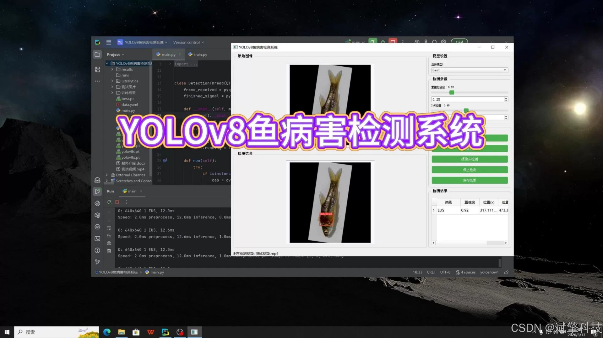
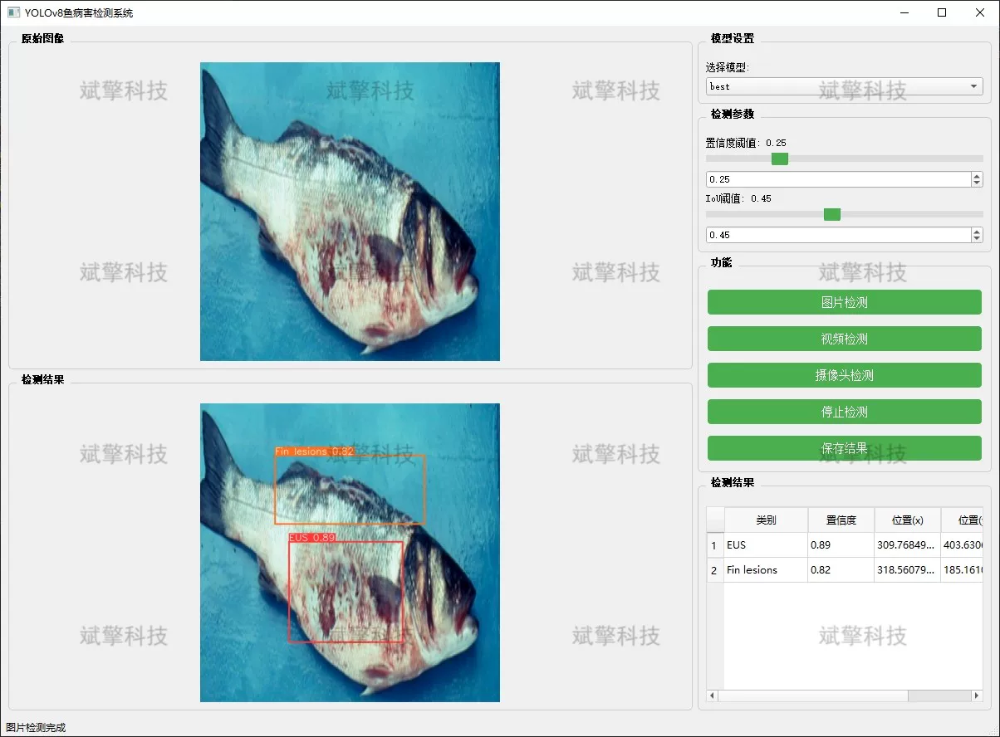
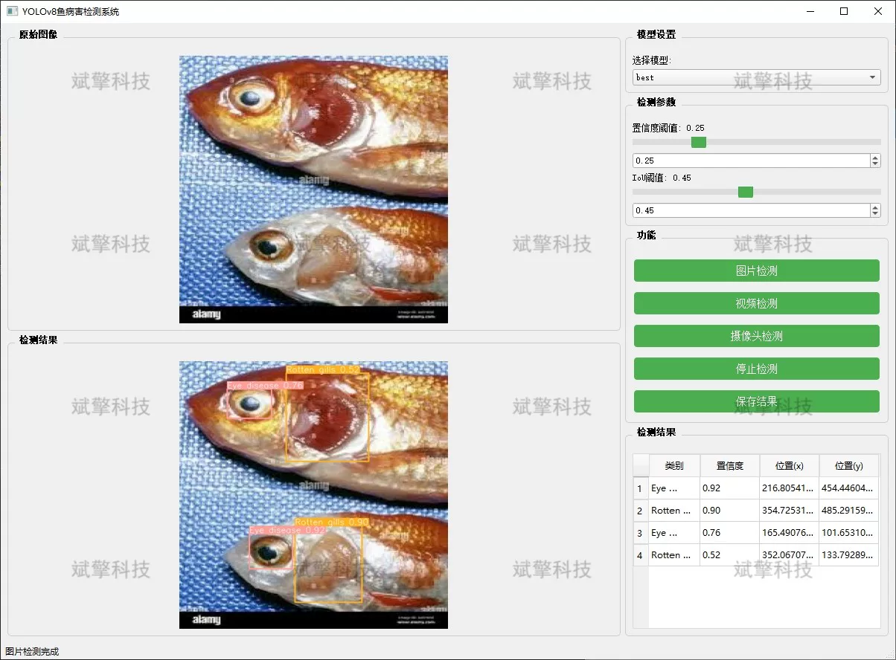
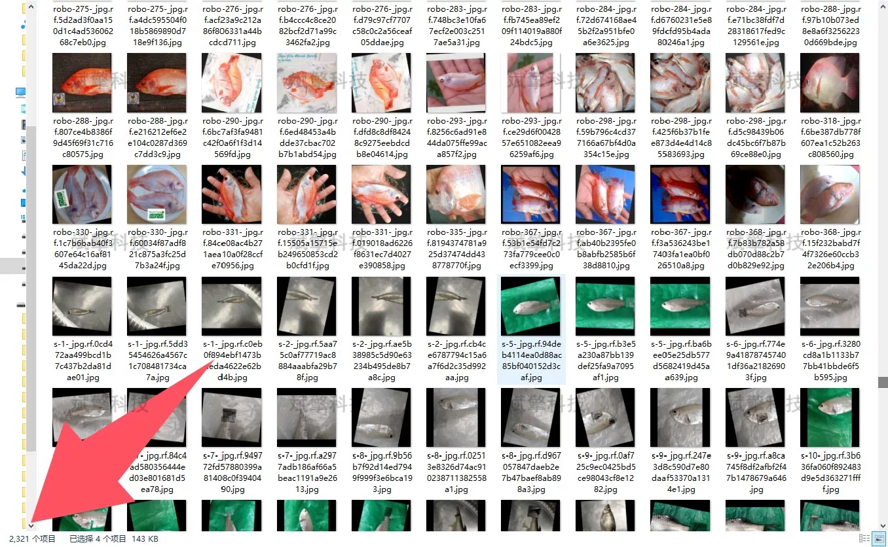
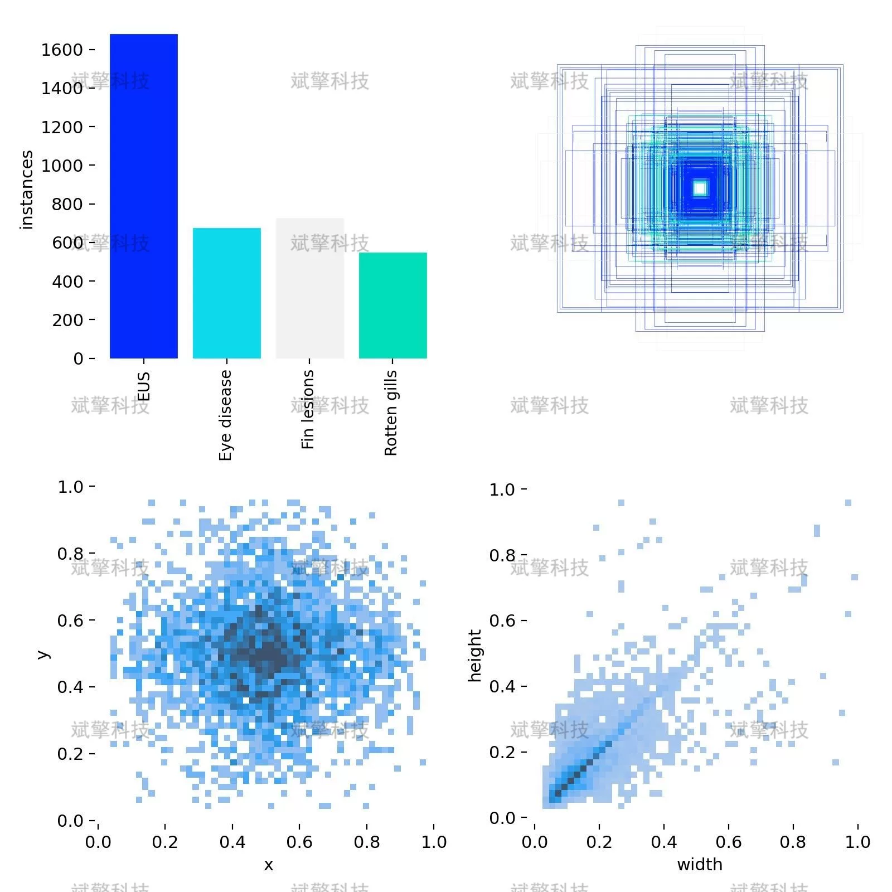
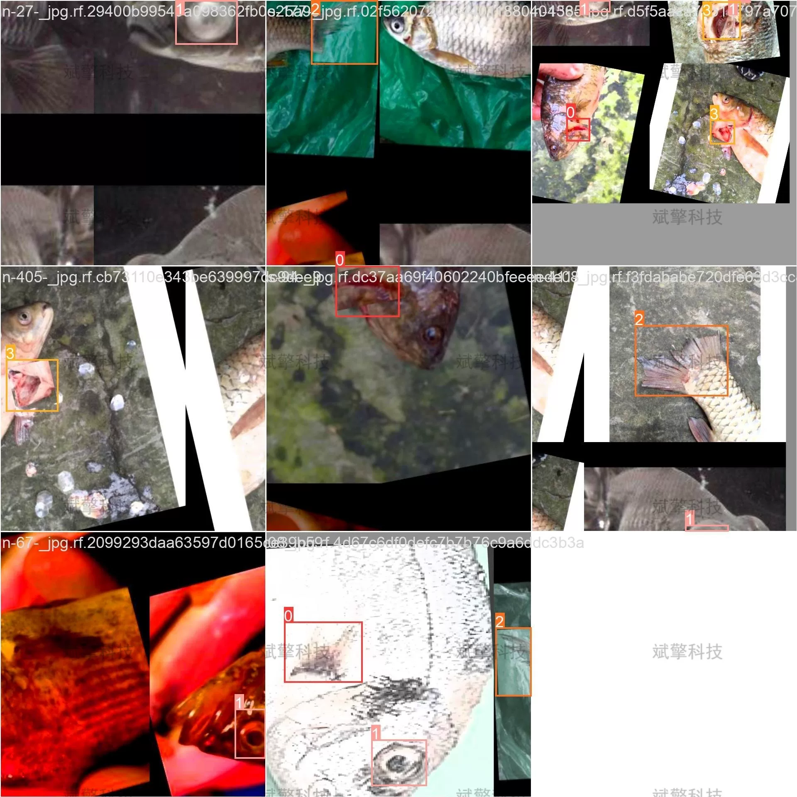
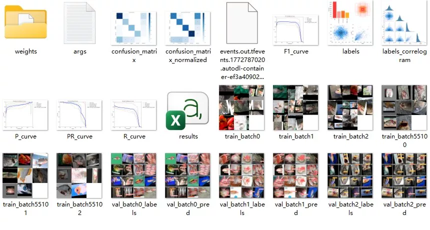
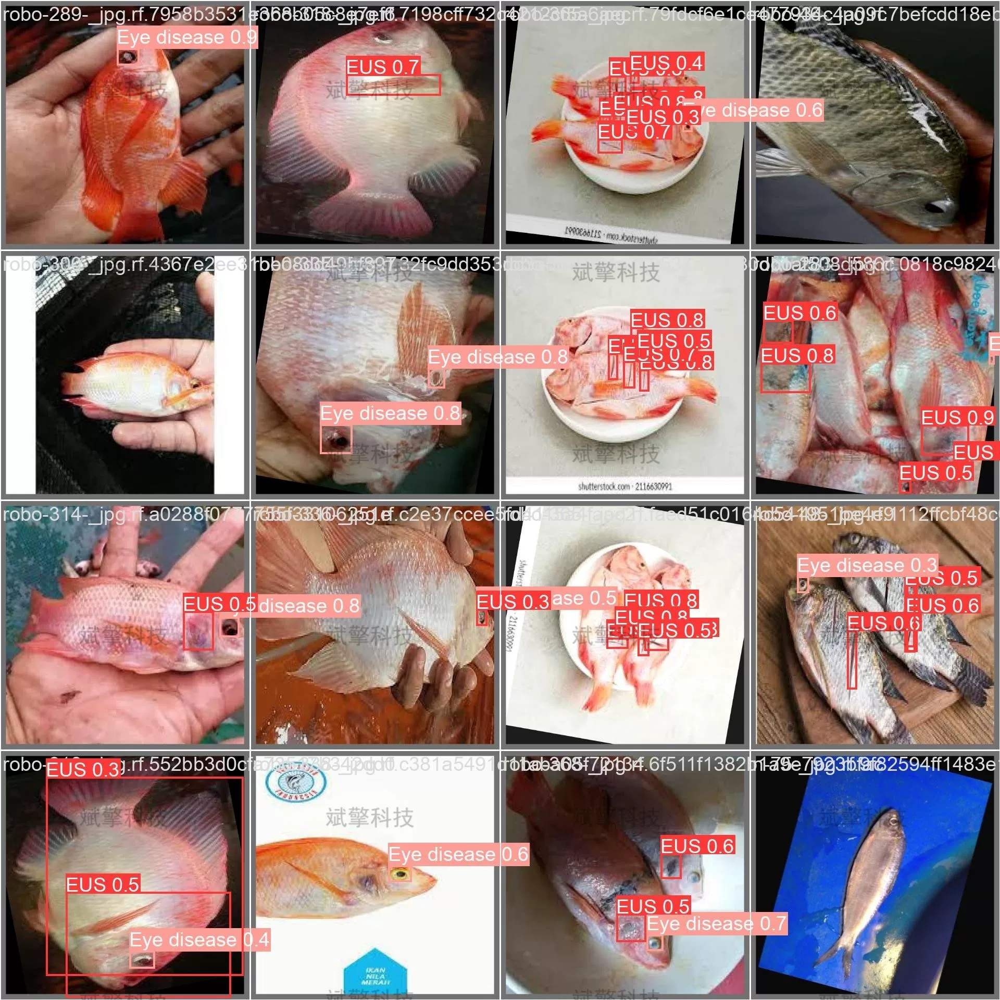

# YOLOv8 fish disease detection system

## Body

YOLOv8 Fish Disease Detection System Based on YOLOv8 Deep Learning (YOLOv8+YOLO dataset + UI interface + Python project source code + Model)

With the rapid development of aquaculture, early detection and prevention of fish diseases have become particularly important. Traditional disease detection methods mainly rely on manual observation, which is not only inefficient but also difficult to achieve real-time monitoring.
This project has developed a fish disease detection system based on the YOLOv8 deep learning model, aiming to achieve rapid and accurate identification of common fish diseases in aquaculture. The system detects four main types of fish diseases: Ulcerative Stomatitis (EUS), eye diseases, fin lesions, and gill rot. By integrating advanced computer vision technology, the system provides complete image, video, and real-time camera detection functions, helping aquaculture practitioners to timely identify diseases, reduce breeding risks, and improve the level of intelligent management of aquaculture.

System Features

✅ Image Detection: Can detect images and return detection boxes and category information.

✅ Video Detection: Supports video file input, detecting the situation of each frame in the video.

✅ Real-time Camera Detection: Connects USB cameras to achieve real-time monitoring.

✅ Parameter Real-Time Adjustment (Confidence and IoU Thresholds)

Dataset Overview

Training set: 2321 images
Validation set: 255 images
Test set: 290 images

## Images

## Payment

Here is a pay link on Stripe ( https://buy.stripe.com/3cs8yP7sY87d0vu9AB ). Please contact me lonlonago@foxmail.com after funding $89, and I will send you a complete data files , thank you!

